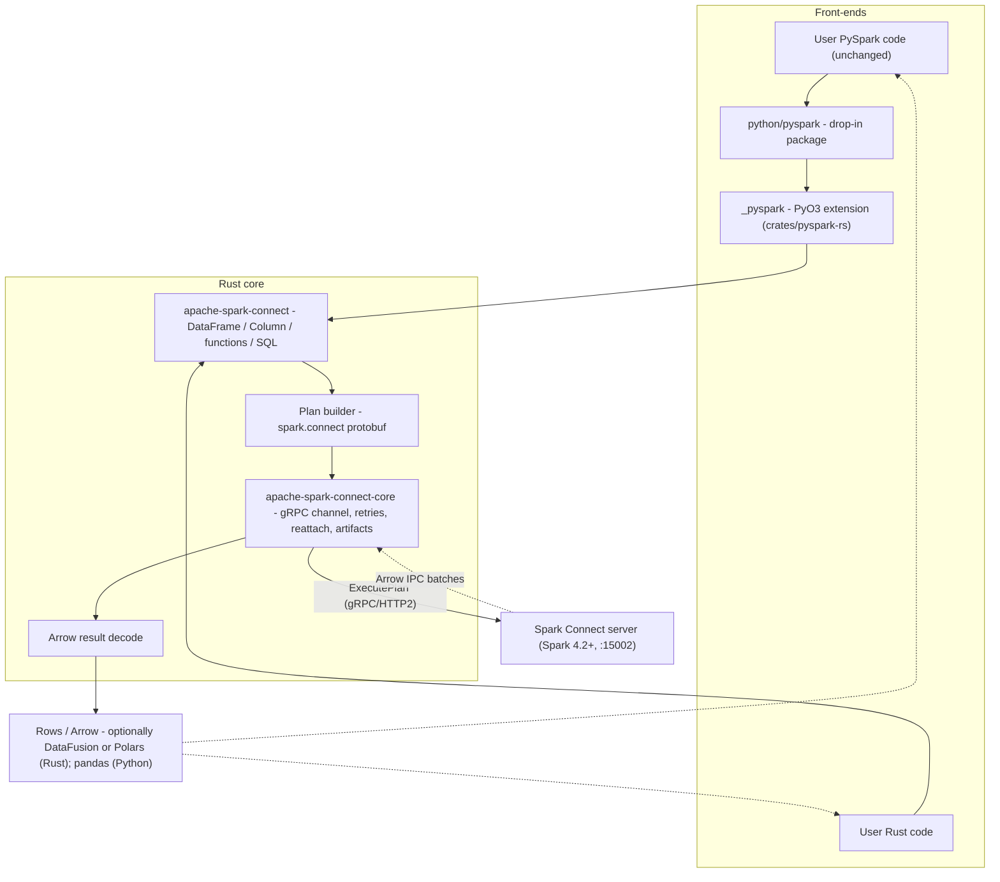
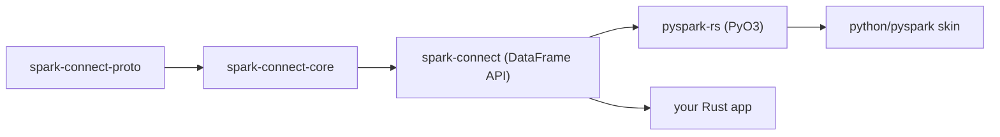
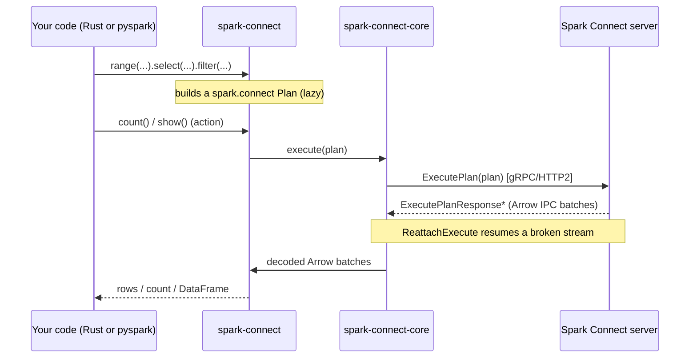
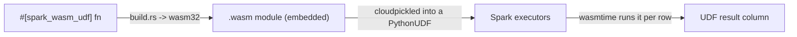

# Architecture

**One protocol, one Rust core, two front-ends.** This project reimplements the
Spark Connect *client* - plan building, gRPC transport, and Arrow result decoding
- in Rust, and exposes it both as a native Rust library and, through PyO3, as a
drop-in `pyspark` package.

## The one big idea

A Spark Connect client does three things: it **builds a protobuf plan** from your
DataFrame/SQL operations, **sends it over gRPC** to a Spark Connect server, and
**decodes the Arrow result** the server streams back. The reference client does
all three in Python.

Here, those three jobs live in Rust crates. On top of that core sit two thin
front-ends that share it: a synchronous **Rust API** shaped like PySpark, and a
**`pyspark` Python package** (a PyO3 extension) that is byte-for-byte compatible
with the reference client. Same `spark.connect` protocol, same server, same
results.

## End-to-end picture



Everything below the front-ends is shared: the Python package doesn't
reimplement anything the Rust API doesn't already do - it calls straight into the
same core through the `_pyspark` extension.

## The crates

A Cargo workspace of library crates, plus a Python skin:

| Component | Path | Responsibility |
|---|---|---|
| `apache-spark-connect-proto` | `crates/spark-connect-proto` | Generated `spark.connect.*` gRPC/protobuf types |
| `apache-spark-connect-core` | `crates/spark-connect-core` | Transport: channel, retries, reattach, artifacts, errors |
| `apache-spark-connect` | `crates/spark-connect` | The DataFrame API: session, dataframe, column, functions, plan, group, catalog, window, readwriter, streaming, types |
| `pyspark-rs` | `crates/pyspark-rs` | PyO3 bindings - builds the `_pyspark` extension module |
| Python skin | `python/pyspark` | The drop-in `pyspark` package (+ vendored `pyspark.pandas`, `cloudpickle`, `pyspark.testing`) |



## A query's lifecycle

When you call an action such as `count()` or `show()`, the lazily-built plan is
serialized and sent to the server; results stream back as Arrow batches.



Transformations are **lazy** - they only build up the plan. Only an *action*
triggers `ExecutePlan`. If the response stream breaks mid-flight, the core's
reattachable-execute iterator resumes from the last response it saw, so long
results survive transient disconnects.

## Two front-ends, one core

=== "Rust (native)"

    ```rust
    use spark_connect::{SparkSession, functions as f};

    let spark = SparkSession::builder()
        .remote("sc://localhost:15002")
        .get_or_create()?;
    spark.range(100)?.select(vec![f::col("id")]).show(20)?;
    ```

=== "Python (drop-in)"

    ```python
    from pyspark.sql import SparkSession, functions as sf

    spark = SparkSession.builder.remote("sc://localhost:15002").getOrCreate()
    spark.range(0, 100).select(sf.col("id")).show(20)
    ```

Both paths build the *same* protobuf plan through the *same* Rust core and get
the *same* Arrow results back. The Python package is a compatibility skin over
`pyspark-rs`; it does not fork or reimplement the client logic.

## Rust UDFs on the executors

Beyond the client, a Rust function can be compiled to WebAssembly and run as a
Spark UDF **on the executors** - shipped inside a standard `PythonUDF` and
executed with `wasmtime`, so nothing Rust-specific is needed server-side.



See [Rust UDFs via WebAssembly](udfs.md) for the full story.

## Design principles

1. **Don't fork PySpark's semantics** - mirror the public API and match the
   reference client's protobuf output, verified by golden-proto tests.
2. **One core, thin front-ends** - the Python package adds no client logic the
   Rust API doesn't already have.
3. **Correctness is gated in CI** - golden-proto tests guard plan building; the
   official Apache Spark Connect test suite guards transport and Arrow paths (see
   the CI notes under `dev/design/`).
4. **Version = Spark version** - the crate/wheel version tracks the Spark release
   it targets, so the number tells you which Spark it speaks.

For the deeper design write-ups (design notes, CI, the official test suite, and
acceptance criteria), see [`dev/design/`](https://github.com/apache/spark-connect-rust/tree/master/dev/design)
in the repository.
